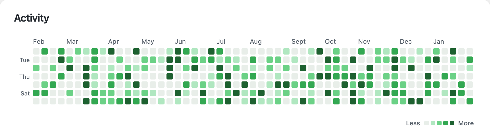
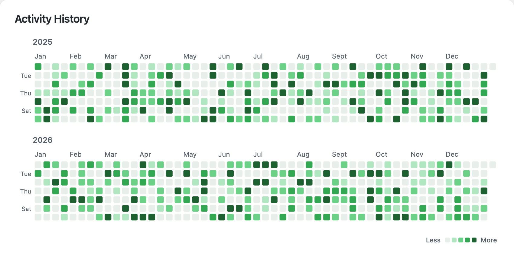
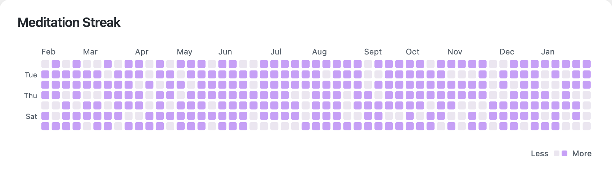
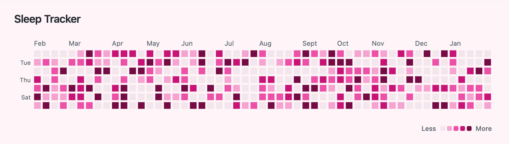
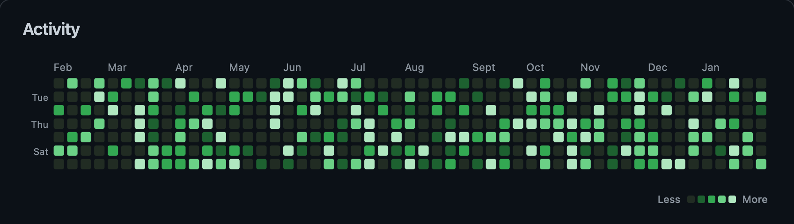
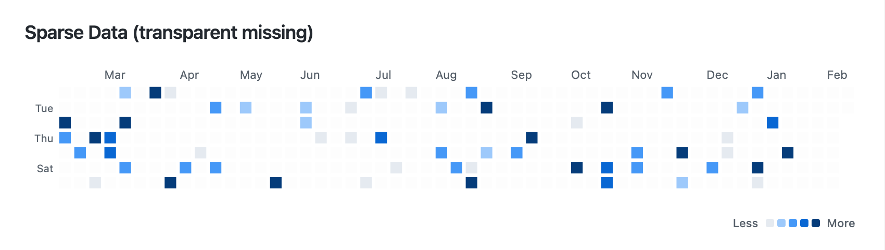
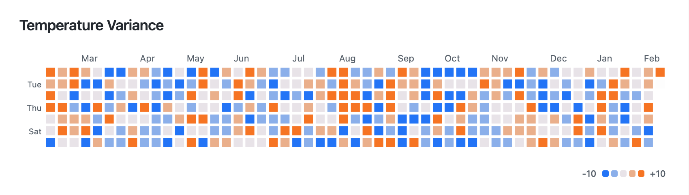
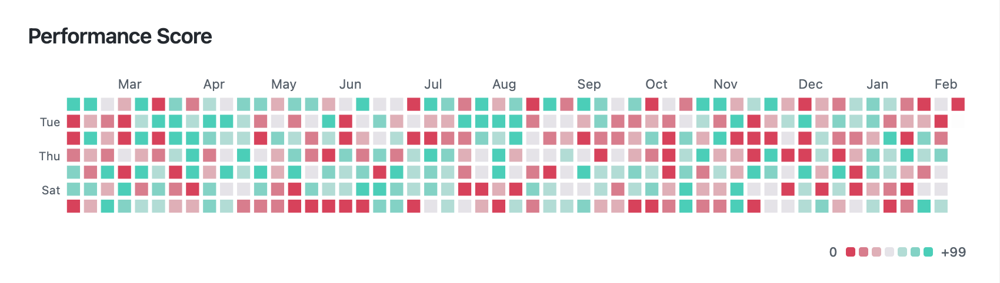
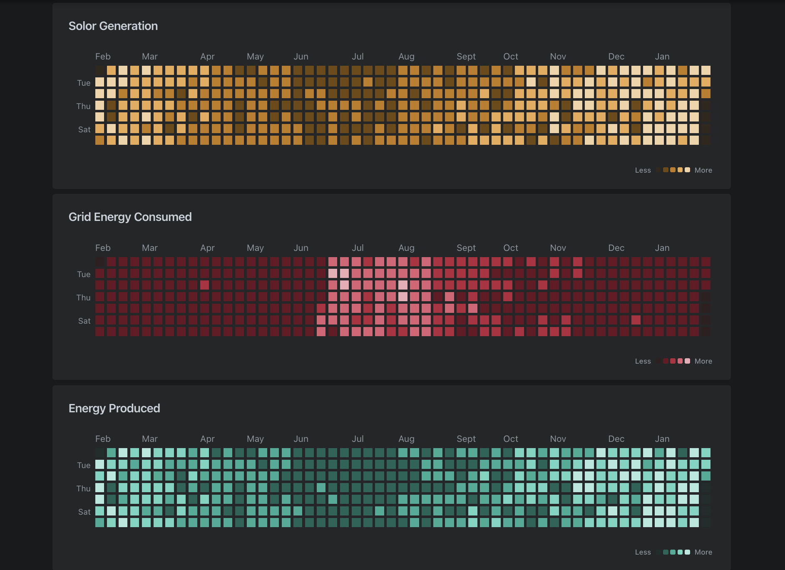

# Zen UI

[](https://github.com/shashanktomar/zen-ui/actions/workflows/ci.yml) [](#) [](#)  

> **Note:** This project is being built with LLM agents, though tested by humans. It is an experiment — please expect issues and [raise them](../../issues).

A collection of beautiful visualization cards for Home Assistant. Track habits, activities, workouts, or any daily metrics with clean, customizable visualizations.

<br>

## Table of Contents

**[`Installation`](#installation)** **[`Cards`](#cards)** **[`Development`](#development)**

<br>

## Installation

<details>

<summary>HACS (Recommended)</summary>

<br>

1. Open HACS in Home Assistant
2. Click the three dots menu (top right) and select "Custom repositories"
3. Add this repository URL and select "Dashboard" as the category
4. Click "Add"
5. Search for "Zen UI" and download it
6. Refresh your browser

</details>

<details>

<summary>Manual Installation</summary>

<br>

1. Download `zen-ui.js` from the [latest release](../../releases)
2. Copy it to your `config/www` folder
3. Add the resource in Home Assistant:
   - Go to **Settings** → **Dashboards** → **Resources**
   - Add `/local/zen-ui.js` as a JavaScript module

</details>

<br>

## Cards

### Heatmap

GitHub-style contribution calendar for visualizing daily metrics.



```yaml
type: custom:zen-ui
card: heatmap
entity: sensor.your_sensor
title: Activity
```

<details>

<summary><b>Configuration Options</b></summary>

<br>

| Option            | Type     | Default      | Description                                                       |
| ----------------- | -------- | ------------ | ----------------------------------------------------------------- |
| `entity`          | string   | **Required** | Entity ID that contains your data                                 |
| `card`            | string   | **Required** | Card type: `heatmap`                                              |
| `title`           | string   | —            | Card title displayed at the top                                   |
| `attribute`       | string   | `data`       | Entity attribute containing the data array                        |
| `range`           | string   | `rolling`    | `rolling` (last 365 days) or `year` (calendar years)              |
| `years`           | number   | `1`          | Number of years to display (only for `range: year`)               |
| `baseColor`       | string   | `#40c463`    | Base color for the heatmap (hex format)                           |
| `negativeColor`   | string   | —            | Color for negative values (hex). Requires `positiveColor`         |
| `positiveColor`   | string   | —            | Color for positive values (hex). Requires `negativeColor`         |
| `neutralValue`    | number   | —            | Center point for diverging colors (default: 0 if in range)        |
| `backgroundColor` | string   | —            | Custom card background color                                      |
| `levelCount`      | number   | `5`          | Number of intensity levels (2-10)                                 |
| `levelThresholds` | number[] | —            | Custom percentage boundaries for levels (see below)               |
| `weekStartDay`    | string   | `monday`     | First day of week: `monday`, `mon`, `sunday`, or `sun`            |
| `valueMode`       | string   | `clamp_zero` | `clamp_zero` (negatives = 0) or `range` (levels span min..max)    |
| `missingMode`     | string   | `zero`       | `zero` (missing = 0) or `transparent` (missing days are distinct) |
| `show_legend`     | boolean  | `true`       | Show the Less/More legend                                         |
| `unit`            | string   | —            | Unit to display in tooltip (auto-detects from entity if not set)  |

> **Note:** When using `valueMode: range` or diverging colors, `missingMode` is automatically set to `transparent` because zero has meaning within the range.

</details>

<details>

<summary><b>Data Sources</b></summary>

<br>

The card supports two data sources:

**1. Statistics API (Recommended)**

Works automatically with any sensor that has `state_class` defined (`measurement`, `total`, or `total_increasing`). Home Assistant records long-term statistics for these sensors.

```yaml
# Just point to your sensor - no extra setup needed
entity: sensor.daily_steps
```

To check if your sensor supports statistics, go to **Developer Tools** → **States** and look for the `state_class` attribute.

**2. Custom Attribute Data**

For sensors without `state_class`, or if you want full control over the data, store an array of `{date, count}` objects in an entity attribute:

```yaml
entity: sensor.my_custom_tracker
attribute: data # default attribute name
```

The attribute should contain:

```json
[
  { "date": "2024-01-15", "count": 5 },
  { "date": "2024-01-16", "count": 3 }
]
```

**Troubleshooting "No data available"**

If you see this message:

1. Check that your sensor has `state_class` defined, OR
2. Ensure your sensor has a `data` attribute with the correct format
3. Verify the entity ID is correct in Developer Tools → States

</details>

#### Examples

**Multi-Year Calendar View**

Display multiple calendar years stacked vertically:



```yaml
type: custom:zen-ui
card: heatmap
entity: sensor.workout_tracker
title: Workout History
range: year
years: 2
```

**Binary/Streak Tracking**

For simple yes/no tracking (did I do it today?), use `levelCount: 2`:



```yaml
type: custom:zen-ui
card: heatmap
entity: sensor.meditation
title: Meditation Streak
levelCount: 2
baseColor: '#c6a0f6'
```

**Custom Background**



```yaml
type: custom:zen-ui
card: heatmap
entity: sensor.sleep
title: Sleep Tracker
baseColor: '#e91e8c'
backgroundColor: '#fff5f8'
```

**Dark Theme**

Automatically adapts to Home Assistant's dark mode.



**More Granular Levels**

Increase intensity levels for more nuanced visualization:

```yaml
type: custom:zen-ui
card: heatmap
entity: sensor.commits
title: Code Commits
levelCount: 8
```

**Custom Thresholds**

Define custom percentage boundaries to control how values map to color intensity levels.

```yaml
type: custom:zen-ui
card: heatmap
entity: sensor.activity
title: Activity Score
levelCount: 5
levelThresholds: [20, 40, 60, 80]
```

**How it works:**

- `levelCount` defines how many distinct colors you'll see (e.g., 5 levels = 5 colors)
- `levelThresholds` defines the percentage boundaries between levels
- You need exactly `levelCount - 1` threshold values (4 boundaries for 5 levels)

With `levelThresholds: [20, 40, 60, 80]` and `levelCount: 5`:

```
Value as % of range    Level    Color intensity
─────────────────────────────────────────────────
    0% - 20%      →    0       (lightest)
   20% - 40%      →    1
   40% - 60%      →    2
   60% - 80%      →    3
   80% - 100%     →    4       (darkest)
```

The "range" depends on your `valueMode`:

- **Default (`clamp_zero`)**: Range is 0 to max value. A value of 50 with max 100 = 50%
- **Range mode**: Range is min to max. A value of 0 with min -10 and max 30 = 25%

**Example: Skewed distribution**

If most of your data is low values with occasional spikes, use lower thresholds:

```yaml
levelThresholds: [5, 15, 35, 70] # More levels for lower values
```

**Week Starting on Sunday**

```yaml
type: custom:zen-ui
card: heatmap
entity: sensor.habits
title: Habit Tracker
weekStartDay: sunday
```

**Sparse Data with Transparent Missing Days**

When your data is sparse and you want to distinguish between "no data" and "zero value":



```yaml
type: custom:zen-ui
card: heatmap
entity: sensor.sporadic_tracker
title: Sporadic Events
missingMode: transparent
```

With `missingMode: transparent`, days without any data appear transparent, while days with an explicit count of 0 still show the empty color. This is useful for sensors that don't report every day.

**Range Mode for Positive/Negative Values**

For data that includes negative values (like energy balance, temperature delta, profit/loss):

```yaml
type: custom:zen-ui
card: heatmap
entity: sensor.energy_balance
title: Energy Balance
valueMode: range
```

With `valueMode: range`, levels are distributed across the full min..max range. Negative values get lower levels, positive values get higher levels, and zero falls somewhere in the middle based on your data distribution. Missing days automatically appear transparent since zero has meaning in range mode.

**Diverging Colors**

For data with positive and negative values, use two colors that meet at a neutral point:



```yaml
type: custom:zen-ui
card: heatmap
entity: sensor.temperature_delta
title: Temperature Variance
negativeColor: '#89b4fa'
positiveColor: '#fab387'
```

This creates a color gradient from blue (cold/negative) through neutral gray to orange (warm/positive). The legend shows actual min/max values (e.g., "-10" to "+8").

**Diverging with Custom Neutral Point**

By default, zero is the neutral point. For data centered around a different value (like scores around 50):



```yaml
type: custom:zen-ui
card: heatmap
entity: sensor.performance_score
title: Performance Score
negativeColor: '#eba0ac'
positiveColor: '#94e2d5'
neutralValue: 50
levelCount: 7
```

Values below 50 appear in maroon tones, values above 50 in teal tones.

> **Note:** Diverging mode requires both `negativeColor` AND `positiveColor`. The `levelCount` is automatically adjusted to be odd (≥3) to ensure a clear center point.

**HA Screenshot**



<br>

## Development

<details>

<summary><b>Setup</b></summary>

<br>

```bash
# Install dependencies
pnpm install

# Start dev server
pnpm dev

# Run tests
pnpm test

# Build for production
pnpm build
```

</details>

<details>

<summary><b>Project Structure</b></summary>

<br>

```
plugin/                      # Home Assistant plugin source
├── zen-ui.ts                # Main component coordinator
├── config.ts                # Configuration validation
├── data-pipeline.ts         # Data processing logic
├── color-utils.ts           # HSL color generation
├── data-sources/            # Data fetching from HA
│   ├── types.ts
│   ├── statistics.ts
│   ├── history.ts
│   └── attribute.ts
├── cards/                   # Card type implementations
│   ├── types.ts             # CardRenderer interface
│   ├── registry.ts          # Card type registry
│   └── heatmap/             # Heatmap card
│       ├── index.ts
│       ├── render.ts
│       └── styles.ts
└── shared/
    └── styles.ts            # Shared card styles

web/                         # Demo & development
├── index.html
└── demo.html
```

</details>

<details>

<summary><b>Testing</b></summary>

<br>

```bash
# Run tests once
pnpm test:run

# Watch mode
pnpm test
```

</details>

<br>

## License

MIT License — see [LICENSE](LICENSE) for details.

## Contributing

Contributions are welcome! Please open an issue first to discuss what you'd like to change.
